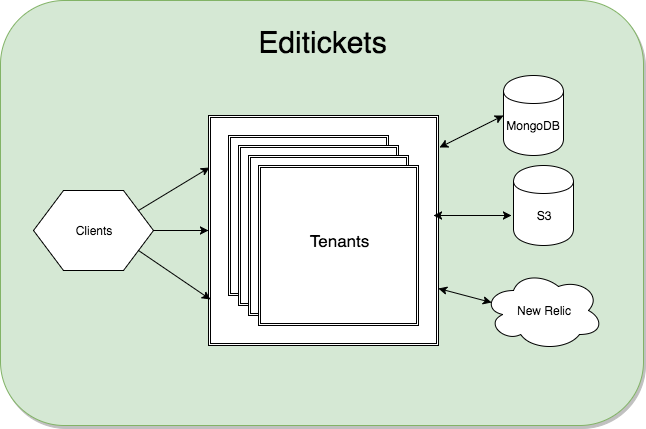

# Editickets

This RestFul API handle tickets sale and support any front-end framework like AngularJS and ReactJS

##Dependencies
* [MongoDB](https://www.mongodb.com/)
* [Express](https://expressjs.com/)

##Technology Stack
* [NodeJS](https://nodejs.org/en/) as default programming language
* [MongoDB](https://www.mongodb.com/)
* [Express](https://expressjs.com/)
* [Mongoose](http://mongoosejs.com/)
* [Swagger](https://swagger.io/)
* [Auth0](https://auth0.com/)

### Running the server
To run the server, run:

```
npm install
```

```
npm start
```

To view the Swagger UI interface:

```
open http://localhost:8090/docs
```

## Architecture



##API 
[API documentation and Models](api-doc.md)

To view the Swagger UI interface:

```
open http://localhost:8090/docs
```


#  Recommendations

## Hosting Provider
The REST API could be hosted on any hosting provider for example:

* [AWS](https://aws.amazon.com/)
* [Heroku](https://www.heroku.com/)
* [Openshift](https://www.openshift.com/)

## Performance Monitoring and Event Management
Editickets will use [new relic](https://newrelic.com/) in the following components:

* Error Handling 
* Performance monitoring (CPU usage, downtime, response time in every endpoint)

## DataStore
Editickets will separate the data in 2 types:

* MongoDB for Data Storage
* S3 for Image Storage

## Autentication

Editickets will use Auth0 as an authentication provider because allows multiple authentication methods for example:

* Username-Password-Authentication
* Social Authentication (Google, Facebook, etc)
* Enterprise
* Passwordless (SMS, Email, Touch ID) 

#Other Recomendations

## Search Improvements
To improve the search response time I recommend use Elastic Search in order to solve tons of user searches and analyze the different patterns.

Another awesome feature I recommend to use is the [geoposition search](https://www.elastic.co/blog/geo-location-and-search), that could be really helpful to expose the upcoming near events.

#Deployment Environment
###Why Kubernetes?
* Runs anywhere
* Automated rollouts and rollbacks
* Horizontal scaling
* Automating deployment 
* Self-healing
* Load balancing
* Configuration management

